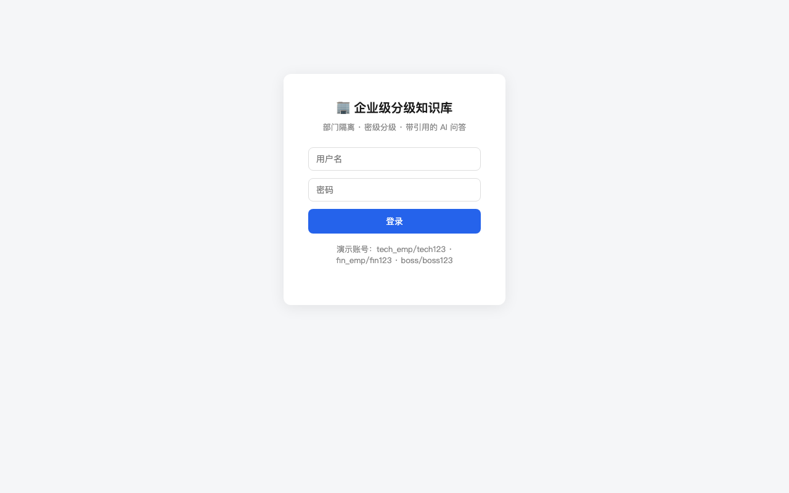
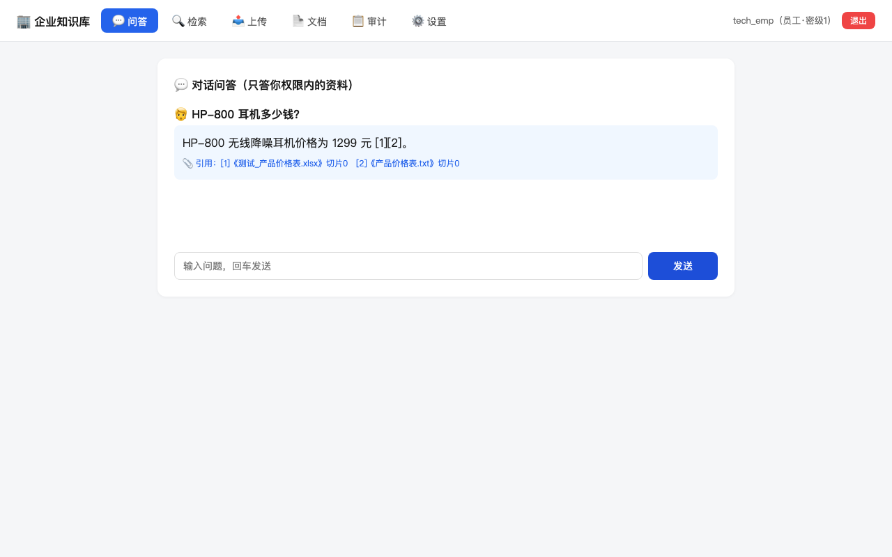
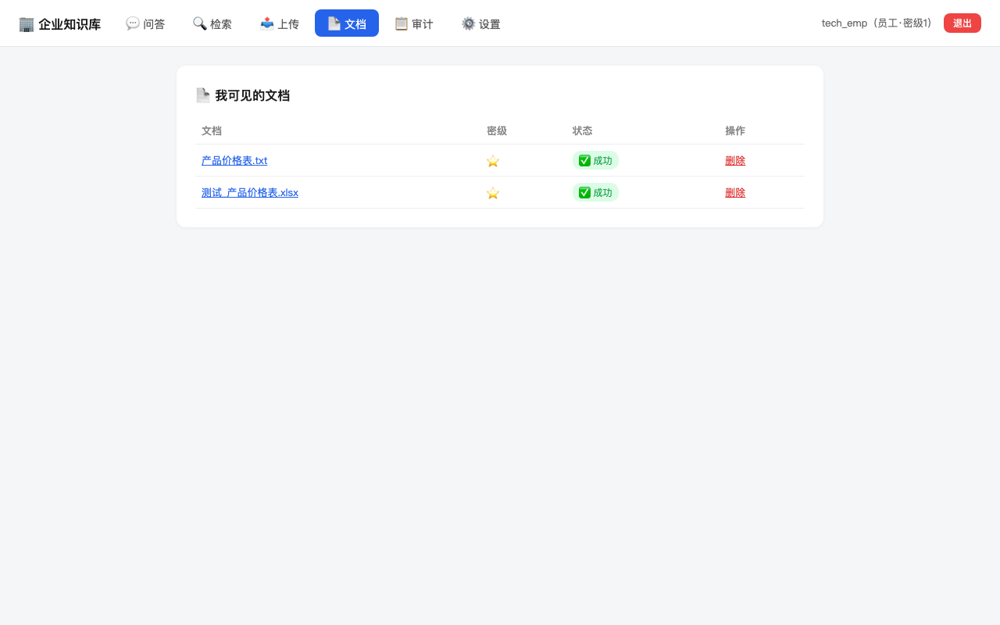
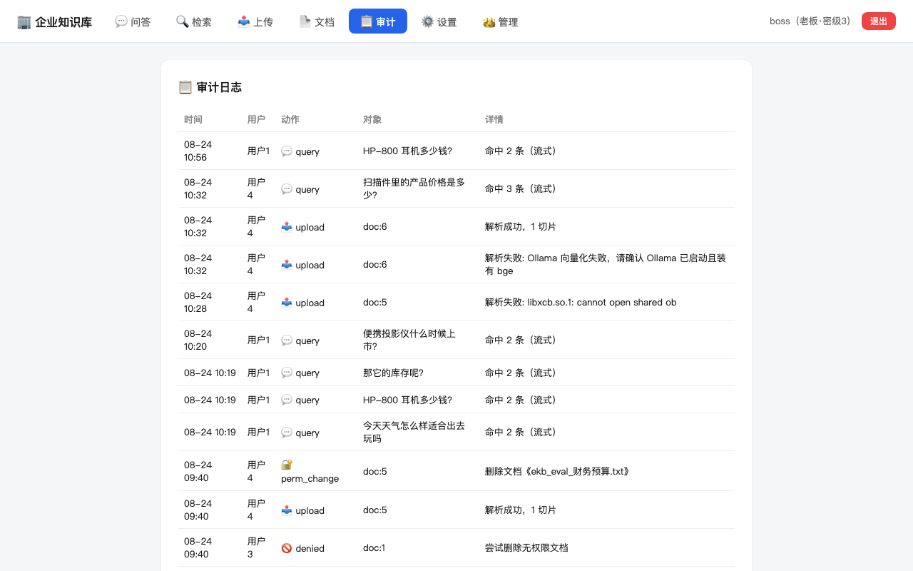
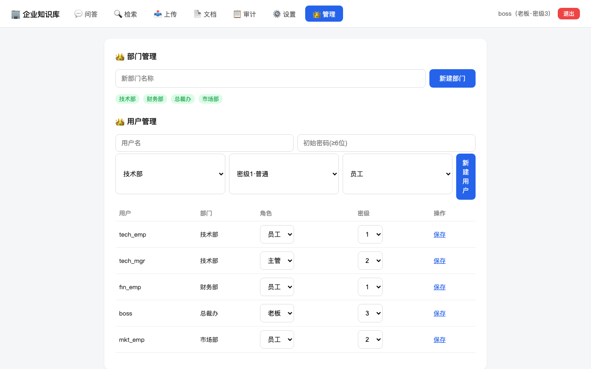
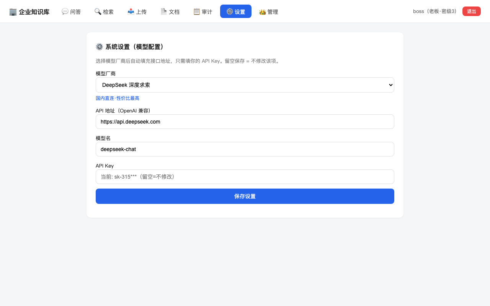

# 企业级分级知识库（Enterprise KB）

> 一个企业级 RAG 知识库 MVP：部门隔离 × 密级分级的权限体系，混合检索 + 引用溯源 + 审计日志。
> 个人作品集项目（求职 Agent 工程师方向）。

## 这是什么

企业员工把文档上传到知识库，AI 帮助检索和问答——**但每个人只能看到自己权限内的数据**：

- 🏢 **部门隔离**：文档挂在部门下，员工只见本部门数据（老板全局可见）
- 🔐 **密级分级**：普通/内部/机密三级，低密级用户物理上检索不到高密级内容
- 🔍 **混合检索**：向量（bge-m3）+ 关键词（BM25）RRF 融合，答案带引用
- 🚫 **明确的边界**：越权 → "权限不足"；未命中 → "未查到"；库里没有 → 拒答
- 📋 **审计日志**：上传/查询/越权尝试全程留痕

## 快速开始

```bash
# 前置：本机 Ollama 已启动且有 bge-m3 模型；backend/.env 配好 DeepSeek key
docker compose up -d --build
open http://localhost:8000/docs    # 交互式 API 文档
```

## 界面截图

| 登录 | 对话问答（流式+引用） |
|---|---|
|  |  |

| 文档管理 | 审计日志 |
|---|---|
|  |  |

| 管理后台（老板） | 模型设置（多厂商） |
|---|---|
|  |  |

## 架构

- 逻辑视图 / 部署视图 / 数据模型 / 核心数据流：见 [docs/02-架构.md](docs/02-架构.md)
- 需求与权限模型：见 [docs/01-需求.md](docs/01-需求.md)

## 技术栈

FastAPI · Chroma · BM25 · Ollama(bge-m3) · DeepSeek API · SQLite · Docker

## 评估报告

**大规模实测（2026-08-24）**：176 条用例，16 份测试文档（txt/docx/xlsx/pdf/扫描件），5 种角色账号：

| 类别 | 结果 |
|---|---|
| 正向问答（事实点+语义变体） | **41/41**（含聚合题、跨格式） |
| 幻觉陷阱（库中不存在的信息） | **24/24** 全部正确拒答 |
| 越权探测（跨部门+密级不足） | **67/67 零泄露** |
| 权限矩阵（search 级穷举） | **31/31** 无越权命中 |
| 聚合与多轮追问 | **13/13** |
| **总计** | **176/176 = 100%** |

基础套件：12/12（scripts/evaluate.py）；单元测试：pytest 6/6。

已知限制（v2 方向）：① 检索相似度阈值已加（0.62），低相关噪声仍会进入候选（由 Rerank 兜底）；② 扫描件 OCR 用 rapidocr 简版（复杂版面建议换更强引擎）；③ 高并发下 LLM 精排是瓶颈（可换专用 reranker）。

## 许可证

MIT（个人学习作品）
